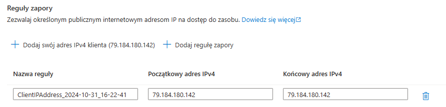
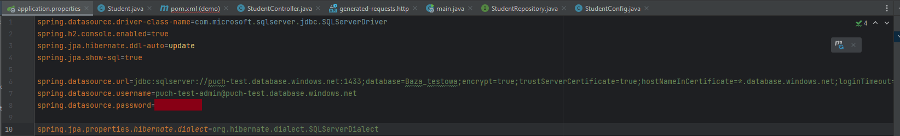

# Baza danych MS SQL Server w Azure #
## Krok 1 ##
Z wykorzystaniem darmowej subskrypcji Azure utworzyłem dostęp na koncie studenckim Microsoft w domenie pw.edu.pl.

## Krok 2 ##
Podczas tworzenia zasobu SQL Database, nadałem projektowi nazwę "Projekt_testowy", a bazie danych "Baza_testowa". Utworzyłem także nowy serwer "puch-test.database.windows.net" i przypisałem uprawnienia administratora do swojego konta.

Następujące konfiguracje zostały ustawione:

Ustawienia dotyczące obliczeń i magazynu zostały pozostawione jako domyślne dla środowiska Development.

Pozostawiona została opcja lokalnie nadmiarowy magazyn kopii zapasowych.

## Krok 3 ##
Baza została wdrożona

## Krok 4 ##
Aby możliwy był dostęp do bazy danych, ustawienia sieciowe zostały skonfigurowane tak, aby wybrane adresy IP miały dostęp do zasobu.

### Azure Data Studio ###

### SSMS ###

## Krok 5 ##
Używając framework'u Spring stworzyłem prostą aplikację do połączenia się z bazą danych.

Aplikacja przewiduje obsługę tabeli "student" z polami:
- id
- email
- first_name
- last_name

W konfiguracji aplikacji dodałem połączenie z bazą danych:

Po uruchomieniu kodu aplikacji, utworzona została tabela Student w bazie danych.

Dodałem dane do tabeli:

Następnie przetestowałem dostęp do bazy danych przez aplikację:

## Krok 6 ##
Utworzyłem maszynę wirtualną z obrazem systemu Windows Server 2022.

## Krok 7 ##
Utworzyłem nową tabelę w magazynie:

Za pomocą przeglądarki magazynu dodałem dane do tabeli:

W aplikacji skonfigurowałem dostęp do magazynu Azure:

## Konfiguracja Firewall Azure SQL Database ##
